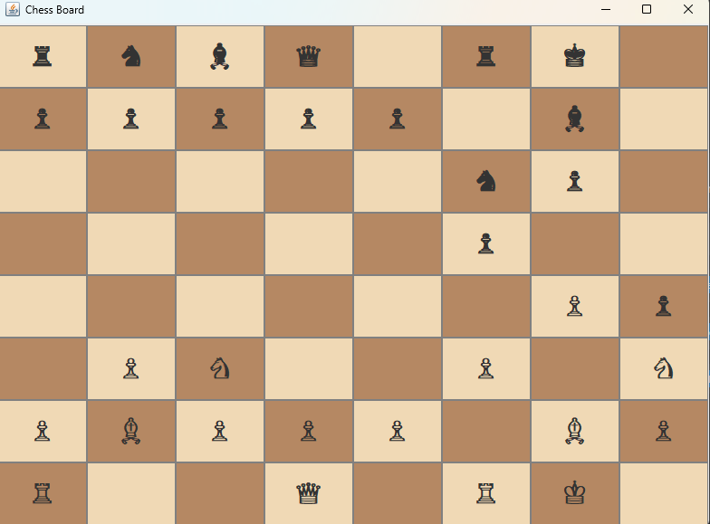

# Chess Game

A fully functional chess game implemented in Java with a graphical user interface using Java Swing. This project provides a complete chess experience with all standard chess rules, including special moves like castling and en passant.



## Table of Contents
- [Overview](#overview)
- [Features](#features)
- [Technical Architecture](#technical-architecture)
- [Getting Started](#getting-started)
- [How to Play](#how-to-play)
- [Piece Movement Rules](#piece-movement-rules)
- [Project Structure](#project-structure)
- [Author](#author)

## Overview

This is a two-player chess game with a clean, intuitive graphical interface. The game displays chess pieces using Unicode characters on a traditional 8x8 chessboard with alternating light and dark squares. Players can select pieces by clicking on them and move them to valid positions following standard chess rules.

## Features

- **Graphical User Interface**: Built with Java Swing, featuring a clean 8x8 chessboard
- **Unicode Chess Pieces**: Visual representation using Unicode chess symbols (♔ ♕ ♖ ♗ ♘ ♙)
- **Turn-Based Gameplay**: Alternating turns between white and black players
- **Move Validation**: Enforces legal moves for all piece types
- **Path Checking**: Validates that pieces cannot jump over other pieces (except knights)
- **Capture Mechanics**: Pieces can capture opponent pieces by moving to their square
- **Special Moves**:
  - **Castling**: Both kingside and queenside castling supported
  - **Pawn Two-Square Advance**: Pawns can move two squares on their first move
  - **Diagonal Pawn Capture**: Pawns capture diagonally
- **Move Counter**: Tracks the number of moves made by each piece
- **Visual Feedback**: Selected pieces are highlighted with a yellow border
- **Console Board View**: Alternative text-based board representation available

## Technical Architecture

The project is organized using object-oriented principles with clear separation of concerns:

### Core Components

1. **Main.java**: Entry point that initializes the game and handles the game loop
2. **Game.java**: Manages game state, turn control, and the GUI board
3. **Board.java**: Handles the board state and piece management
4. **Piece.java**: Abstract base class for all chess pieces with common movement logic

### Piece Hierarchy

Each chess piece is implemented as a separate class inheriting from `Piece`:
- **King.java**: King piece with special castling logic
- **Queen.java**: Queen with combined rook and bishop movement
- **Rook.java** (Rock.java): Rook with horizontal and vertical movement
- **Bishop.java**: Bishop with diagonal movement
- **Knight.java**: Knight with L-shaped movement
- **Pawn.java**: Pawn with forward movement and diagonal capture

### Key Design Patterns

- **Object-Oriented Design**: Each piece type encapsulates its own movement rules
- **MVC Pattern**: Separation between game logic (Board), view (GUI), and control (Game)
- **Event-Driven Architecture**: Mouse listeners handle user interactions
- **Coordinate System**: Uses chess notation (A-H, 1-8) for position tracking

## Getting Started

### Prerequisites

- Java Development Kit (JDK) 8 or higher
- Java Runtime Environment (JRE)

### Compilation

Navigate to the chess directory and compile all Java files:

```bash
cd chess/src
javac Main.java pieces/*.java utility/*.java
```

Or if you have the bin directory set up:

```bash
javac -d bin src/Main.java src/pieces/*.java src/utility/*.java
```

### Running the Game

Run the compiled program:

```bash
java Main
```

Or from the project root:

```bash
cd chess
java -cp bin Main
```

The game window will appear with the chessboard ready for play.

## How to Play

1. **Starting the Game**: White moves first
2. **Selecting a Piece**: Click on a piece to select it (it will be highlighted with a yellow border)
3. **Moving a Piece**: Click on a valid destination square
   - If the move is legal, the piece will move to that square
   - If the move is illegal, the piece will be deselected
4. **Capturing**: Click on an opponent's piece to capture it (if the move is valid)
5. **Deselecting**: Click the same piece again to deselect it
6. **Castling**: Select the king and click on the rook you wish to castle with (if conditions are met)

### Game Rules

- Players alternate turns (white, then black)
- A piece can only move to a square that is empty or occupied by an opponent's piece
- You cannot move a piece to a square occupied by your own piece
- Most pieces cannot jump over other pieces (except the knight)
- The game validates all moves according to standard chess rules

## Piece Movement Rules

### Pawn
- Can move **1 space forward** (if not blocked)
- Can move **2 spaces forward** on its initial move (if not blocked)
- Can move/kill enemy pieces **diagonally** (one square)
- Cannot move backward

### King
- Can move **1 space in any direction** (horizontal, vertical, or diagonal)
- Cannot move to a square occupied by a friendly piece
- Can **castle** with a rook under specific conditions:
  - Neither the king nor the rook has moved
  - No pieces are between them
  - The king is not in check (Note: full check detection may need enhancement)

### Queen
- Can move **diagonally, horizontally, and vertically** any number of squares
- Cannot jump over other pieces
- Most powerful piece on the board

### Bishop
- Can move **diagonally** any number of squares
- Cannot jump over other pieces
- Each bishop remains on its starting color throughout the game

### Rook (Tower)
- Can move **horizontally and vertically** any number of squares
- Cannot jump over other pieces
- Essential for castling with the king

### Knight
- Moves in an **L-shape**: 2 squares in one direction and 1 square perpendicular
- **Can jump over other pieces** (only piece with this ability)
- Always lands on a square of opposite color from its starting position

## Project Structure

```
chess/
├── README.md                 # This file
├── chess-screenshot.png      # Screenshot of the game
└── chess/
    ├── README.md            # Additional piece rules documentation
    ├── chart.png            # Visual reference
    ├── src/                 # Source code
    │   ├── Main.java        # Main entry point
    │   ├── pieces/          # Chess piece classes
    │   │   ├── Piece.java   # Abstract base class
    │   │   ├── King.java
    │   │   ├── Queen.java
    │   │   ├── Rock.java    # Rook implementation
    │   │   ├── Bishop.java
    │   │   ├── Knight.java
    │   │   └── Pawn.java
    │   └── utility/         # Game management classes
    │       ├── Game.java    # Game controller and GUI
    │       └── Board.java   # Board state management
    └── bin/                 # Compiled class files
```

## Author

**Team Name**: Russell Sullivan (One Man Army)

## Future Enhancements

Potential improvements for the project:
- Full check and checkmate detection
- Stalemate detection
- En passant capture for pawns
- Pawn promotion when reaching the opposite end
- Move history tracking
- Game save/load functionality
- AI opponent
- Move timer
- Highlighted valid moves for selected pieces

---

*This is an educational project demonstrating object-oriented programming principles and GUI development in Java.*
